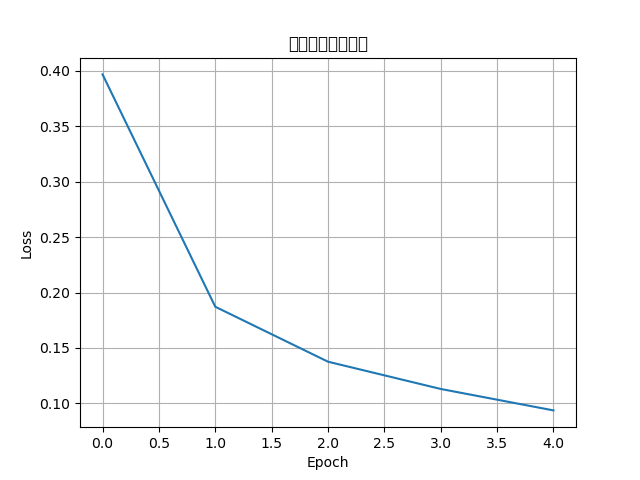

# MNIST 手写数字识别

用 PyTorch 训练一个简单神经网络识别手写数字。

## 文件

- `mnist_train.py`：基础版，2层全连接 + SGD
- `mnist_full.py`：改进版，3层网络 + Adam，含测试准确率和损失曲线

## 运行

python mnist_train.py
python mnist_full.py

## 结果

测试准确率约 97%，损失曲线：

